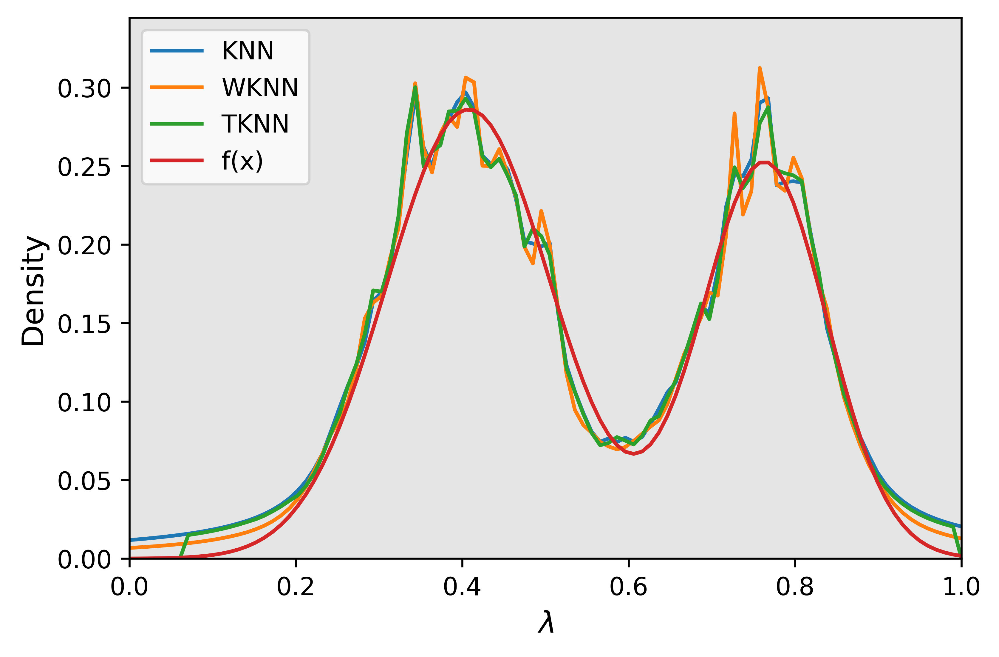

# Summary

    Nearest neighbor based density estimations are a class of density estimation methods that improve the traditional kernel density estimation by allowing the estimation to have varying bandwidth depending on nearest neighbor distances. Several advantages are possessed by NN based density estimations. They are lazy learning methods that require no training stage. They utilize local information for bandwidth selection [@orava2011k]. Their straightforward logic naturally satisfies the requirements of trustworthy AI [@papernot2018deep; @gopfert2022interpretable]. The NNDensity package provides an efficient implementation of six NN based density methods that users can directly apply in related studies. The package is presented in a class-based manner for extensibility and is compatible with *scikit-learn* based parameter tuning functions such as *sklearn.GridSearchCV*. NNDensity's built-in Cython implemented Adaptive KD tree, which is modified from *sklearn.neighbors.KDTree*, provides convenient local neighbor selection scheme and is extensible for more adaptive selection functions. Moreover, we provide efficient tools for complex distribution generation and density estimation visualization.

# Statement of Need

    There is barely any implementation of nearest neighbor based density estimation methods since the original algorithm is, if equipped with well developed KD tree structure, straightforward and leaves no space for further optimizing. However, as [@kovacs2017balanced; @zhao2020analysis] illustrated, the performance of estimation, such as accuracy and robustness, is improved if the estimator is chosen from a large functional space, for instance when NN density estimation is weighted or adaptive. These evolutions of NN bring a challenge to algorithm implementation as well as parameter tuning. NNDensity for the first time provides user-friendly functions for six NN based density methods, namely KNN [@loftsgaarden1965nonparametric], WKNN [@biauweighted], TKNN [@zhao2020analysis], BKNN [@kovacs2017balanced] and newly proposed AKNN and AWNN. For parameter tuning, NNDensity is compatible with cross-validation methods in *scikit-learn* and is extensible for further development. Under the research framework of density estimation, researchers in this area often deal with complex distributions. NNDensity includes efficient functions for generating complex distributions such as densities with different marginals and a mixture of densities. Also, basic visualization tools that exhibit the behavior of estimation in arbitrary dimensions are provided. 

    A key component for NN based methods is the KD tree structure. A great many packages provided different implementation schemes [@sklearn_api, @SciPy-2020] for KD tree. @githubpage has done a thorough comparison from perspectives such as dimension restriction, query speed, and parallelizability. However, consider if we want to search the largest $k$ such that $k\cdot R_k(x)<C$, where $R_k(x)$ is the kth nearest neighbor distance for $x$. For common KD tree implementations, we would have to query $(R_1(x),\cdots, R_n(x))$ and search iteratively. This guarantees the correct solution when $k=n-1$ but causes much waste of computation if $k=2$. Thus, NNDensity choose to modify sklearn, which is based on Cython, to implement a KD tree structure with a built-in adaptive neighbor search algorithm. The algorithm halts the searching of neighbors when nearest neighbor distances exceed some thresholds, which is a much more efficient approach than static searching after querying all the distances. 

# Methods

    In this section, we introduce the nearest neighbor estimation methods included in NNDensity. We denote $R_k(x)$ as the distance between $x$ and its $k$-th nearest neighbor. Given $n$ independent identically distributed dataset $\{X_1,\cdots,X_n\}=:D_n \in \mathbb{R}^d$, the standard $k$-NN density estimator (**KNN**) [@loftsgaarden1965nonparametric; @dasgupta2014optimal] for each point $x \in \mathbb{R}^d$ is defined as 
$$
f_k(x)=\frac{k/n}{V_d R_k^d(x)}
$$
where $V_d$ be the volume of the unit ball in $\mathbb{R}^d$. An intuitive explanation of this estimator is that from order statistics. $P(B(x, R_k(x)))$ follows Beta Binomial distribution $Beta(k, n − k + 1)$. As a result, we have $\mathbb{E}[P(B(x, R_k(x)))] = k/(n + 1)$. Therefore, we have the approximation $k/n ≈ P(B(x, R_k(x))) ≈ f(x)V_d R_k(x)^d$. @biauweighted intended to smooth the standard KNN by aligned weighting and proposed **WKNN** defined as 
$$
{f}_{{W}}(x)=\frac{\sum_{i=1}^{k}w_{i}i/n}{V_d\sum_{i=1}^{k}w_{i} R_{i}^d(x)}
$$
where $w_1,\cdots w_k$ are fixed positive weights summing to 1. In practice, $w_i$ is usually set to $1/k$. KNN and WKNN both utilize fixed weights for all $x$. @zhao2020analysis proposed a truncated method **TKNN** to fix the potential problem at the tail of the distribution. They perform a pre-estimation using uniform kernel and substitute the pre-estimation with standard KNN when the pre-estimation is large, namely 
$$
\hat{f}(\mathbf{x})=\left\{\begin{array}{cll}
\frac{k}{n V_d R_k^d(x)} & \text { if } & \hat{f}(x) \leq a \\
\hat{f}(x) & \text { if } & \hat{f}(x)>a
\end{array}\right.
$$
where $\hat{f}(x)$ is uniform kernel density estimator. Their method is still non-adaptive, i.e. using a fixed number of neighbors, in most regions. Recently, @kovacs2017balanced argued that adaptive choice of weights (number of neighbors) brings advantages to estimation when encountering densities with drastically varying values. Their **BKNN** demonstrate that by selecting largest $k(x)$ such that
$$
k(x)\cdot R_{k(x)}^d(x)<C
$$
for some constant $C$ and dimension $d$, the prediction $k(x)/(nV_dR_{k(x)^d(x)})$ performs better. BKNN provides a plug-in parameter selection scheme for $C$, which fails to cover the case when the dimension is higher than 2. A work in progress, called **AKNN**, argues that the suitable choice is instead 
$$
k(x)\cdot R_{k(x)}^2(x) < C, 
$$
whose theoretical optimality has been shown for any dimension. Moreover, another work in progress considers adaptive weighted nearest neighbor estimation. Weighted estimation for each $x$ is formalized as 
$$
f_{A}(x)=\frac{\sum_{i=1}^{k(x)}w_{i}(x)i/n}{V_d\sum_{i=1}^{k(x)}w_{i}(x) R_{i}^d(x)}
$$
where $w_1(x),\cdots,w_{k(x)}(x)$ are local weights at $x$. Motivated by the bias-variance decomposition for the pointwise error, an efficient optimization approach is provided to select the weights of nearest neighbors for each $x$ adaptively. Theoretically, the above two adaptive methods are capable to improve the estimation of probability functions when $f(x)$ is heavy-tailed or varies drastically in magnitude.
In practice, we apply KD tree from *scikit-learn* to KNN, WKNN, TKNN, and AWNN. Both AKNN and BKNN are implemented through the built-in function in the Adaptive KD tree and achieve roughly the same computational cost as a normal KD tree query. The optimization algorithm of AWNN for weight selection is accelerated via *numba*. 

In what follows, we use a toy example to exhibit the functionality of NNDensity. We first generate 1000 samples from a mixture of Gaussian distribution. The following figure shows the estimation results of methods in NNDensity. 

{width=50%}
{width=50%}

# Dependencies

*NNDE* utilizes tools and functionality from *numpy* [@numpy-2020], *matplotlib* [@matplotlib-2007], *scipy* [@SciPy-2020], *jupyter notebooks* [ipython-2007], *scikit-learn* [@sklearn_api], *Cython* [@behnel2011cython] and *numba* [@lam2015numba]. 

# Reference

